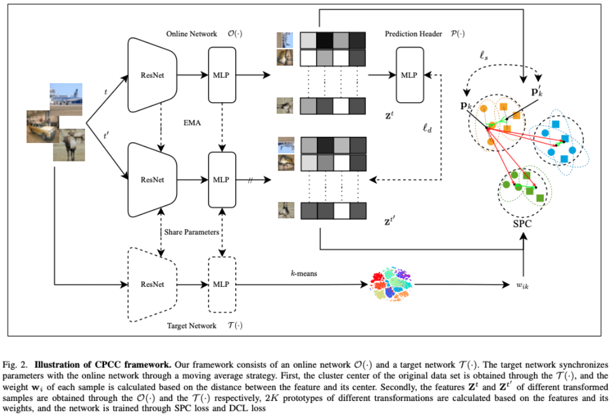

# Center-Oriented Prototype Contrastive Clustering
## Abstract
Contrastive learning is widely used in clustering tasks due to its discriminative representation. However, the conflict problem between classes is difficult to solve effectively. Existing methods try to solve this problem through prototype contrast, but there is a deviation between the calculation of hard prototypes and the true cluster center. To address this problem, we propose a center-oriented prototype contrastive clustering framework, which consists of a soft prototype contrastive module and a dual consistency learning module. In short, the soft prototype contrastive module uses the probability that the sample belongs to the cluster center as a weight to calculate the prototype of each category, while avoiding inter-class conflicts and reducing prototype drift. The dual consistency learning module aligns different transformations of the same sample and the neighborhoods of different samples respectively, ensuring that the features have transformation-invariant semantic information and compact intra-cluster distribution, while providing reliable guarantees for the calculation of prototypes. Extensive experiments on five datasets show that the proposed method is effective compared to the SOTA. Our code is published on https://github.com/LouisDong95/CPCC.
## Pipline

## Experiments
```python
python main.py config/cifar10_r18_propos.yml
```
## Cite
If you find this code useful for your research, please consider citing our paper and related research:
```
@inproceedings{DBLP:conf/icmcs/DongICME25,
  author       = {Shihao Dong and
                  Xiaotong Zhou and
                  Yuhui Zheng and
                  Huiying Xu and
                  Xinzhong Zhu},
  title        = {Center-Oriented Prototype Contrastive Clustering},
  booktitle    = {{IEEE} International Conference on Multimedia and Expo},
  year         = {2025}
}
@article{DBLP:journals/pami/HuangCZS23,
  author       = {Zhizhong Huang and
                  Jie Chen and
                  Junping Zhang and
                  Hongming Shan},
  title        = {Learning Representation for Clustering Via Prototype Scattering and
                  Positive Sampling},
  journal      = {{IEEE} Trans. Pattern Anal. Mach. Intell.},
  volume       = {45},
  number       = {6},
  pages        = {7509--7524},
  year         = {2023},
  url          = {https://doi.org/10.1109/TPAMI.2022.3216454},
  doi          = {10.1109/TPAMI.2022.3216454},
  timestamp    = {Mon, 26 May 2025 08:51:13 +0200},
  biburl       = {https://dblp.org/rec/journals/pami/HuangCZS23.bib},
  bibsource    = {dblp computer science bibliography, https://dblp.org}
}
```